# UML Class Diagram

## Backend Architecture

Given that the project documentation includes **Sequence Diagrams** (for interaction flow), **Activity Diagrams** (for UI/UX workflows), and a **Deployment Diagram** (for infrastructure), this Class Diagram focuses strictly on the **Static Code Structure**.

It details the Classes, Attributes, Methods, and Relationships of the backend system, serving as the structural blueprint that supports the dynamic flows shown in the other diagrams.

### System Structure

```mermaid
classDiagram
    %% --- MODELS ---
    namespace Models {
        class Desk {
            +string desk_id
            +string name
            +int room_id
            +int floor_id
            +boolean is_removed_from_api
            +room()
            +floor()
            +user()
            +metrics()
            +schedules()
            +sensorMetrics()
        }

        class DeskMetric {
            +string desk_id
            +float height_mm
            +boolean is_sitting
            +datetime recorded_at
            +desk()
        }

        class Floor {
            +string name
            +int floor_number
            +string description
            +rooms()
            +desks()
            +allDesks()
        }

        class Room {
            +string name
            +int floor_id
            +string description
            +floor()
            +desks()
        }

        class Schedule {
            +string type
            +string title
            +float height
            +time start_time
            +time end_time
            +date date
            +string frequency
        }

        class SensorMetric {
            +string desk_id
            +float temperature
            +float humidity
            +float light
            +datetime recorded_at
            +desk()
        }

        class User {
            +string first_name
            +string last_name
            +string email
            +string password
            +float height
            +int age
            +boolean needs_personalization
            +boolean is_admin
            +string desk_id
            +float optimal_sitting_height
            +float optimal_standing_height
            +getFullNameAttribute()
            +desk()
        }
    }

    %% --- SERVICES ---
    namespace Services {
        class DeskApiService {
            +getAllDeskIds()
            +getDeskData(string deskId)
            +updateDeskPosition(string deskId, int positionMm)
        }

        class HeightCalculationService {
            +calculateOptimalHeights(int heightCm)
        }

        class UserHeightObserver {
            +updating(User user)
            +creating(User user)
        }
    }

    %% --- CONTROLLERS ---
    namespace Controllers {
        class DeskController {
            +index()
            +show(id)
            +setHeight(request, id)
            +assignUser(request, id)
            +getMetrics(id)
            +stats()
        }

        class UserController {
            +show(id)
            +store(request)
            +update(request, id)
            +assignDesk(request, id)
        }

        class AdminController {
            +index()
            +schedules()
            +userManagement()
            +getDashboardMetrics()
        }

        class ArrangementController {
            +index()
            +getDesks()
        }

        class AuthController {
            +showLogin()
            +login(request)
            +showPersonalize()
            +savePersonalization(request)
            +logout(request)
        }

        class HomeController {
            +index()
            +settings()
            +getDeskMetrics()
            +updateCustom(request)
        }

        class OfficeManagementController {
            +index()
            +getFloors()
            +createFloor(request)
            +getRooms()
            +createRoom(request)
            +assignDeskLocation(request, id)
        }

        class ScheduleController {
            +store(request)
            +destroy(schedule)
        }
    }

    %% --- CONSOLE COMMANDS ---
    namespace Console {
        class SyncDesksFromApi {
            +handle()
        }
        class CollectDeskMetrics {
            +handle()
        }
        class ListenMqtt {
            +handle()
        }
        class RunSchedules {
            +handle()
        }
        class RecalculateUserHeights {
            +handle()
        }
    }

    %% --- MIDDLEWARE ---
    namespace Middleware {
        class IsAdmin {
            +handle(request, next)
        }
        class CheckDeskAssignment {
            +handle(request, next)
        }
    }

    %% --- RELATIONSHIPS ---

    %% Model Relationships
    Floor "1" -- "*" Room : contains
    Room "1" -- "*" Desk : contains
    Desk "1" -- "0..1" User : assigned to
    Desk "1" -- "*" DeskMetric : records
    Desk "1" -- "*" SensorMetric : records
    Desk "1" -- "*" Schedule : has

    %% Controller Dependencies
    DeskController ..> Desk : uses
    DeskController ..> User : uses
    DeskController ..> DeskMetric : uses
    DeskController ..> DeskApiService : uses

    UserController ..> User : uses
    UserController ..> Desk : uses

    AdminController ..> Schedule : uses
    AdminController ..> DeskMetric : uses
    AdminController ..> User : uses
    AdminController ..> SensorMetric : uses

    ArrangementController ..> Desk : uses
    ArrangementController ..> Floor : uses
    ArrangementController ..> DeskApiService : uses

    AuthController ..> User : uses

    HomeController ..> User : uses
    HomeController ..> SensorMetric : uses
    HomeController ..> DeskMetric : uses

    OfficeManagementController ..> Floor : uses
    OfficeManagementController ..> Room : uses
    OfficeManagementController ..> Desk : uses
    OfficeManagementController ..> DeskApiService : uses

    ScheduleController ..> Schedule : uses

    %% Service Dependencies
    UserHeightObserver ..> HeightCalculationService : uses
    UserHeightObserver ..> User : observes

    %% Command Dependencies
    SyncDesksFromApi ..> DeskApiService : uses
    SyncDesksFromApi ..> Desk : uses
    CollectDeskMetrics ..> DeskApiService : uses
    CollectDeskMetrics ..> DeskMetric : uses
    ListenMqtt ..> SensorMetric : uses
    RunSchedules ..> Schedule : uses
    RunSchedules ..> Desk : uses
    RecalculateUserHeights ..> HeightCalculationService : uses
    RecalculateUserHeights ..> User : uses
```

